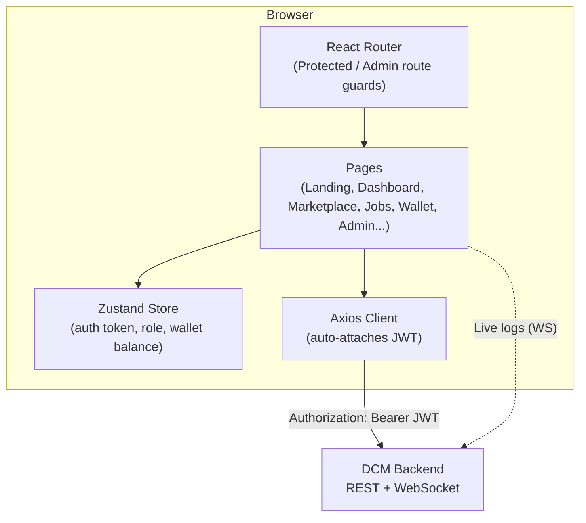

# DCM Frontend — Web App


The user-facing web application for **DCM (Distributed Compute Marketplace)**. This is where job submitters register, browse available compute workers, submit training jobs, watch them run in real time, and manage their wallet — plus a full admin panel for platform oversight.

A standalone single-page app (SPA), built with React + Vite, talking to the [DCM Backend](../DCM-Backend) over a REST API and a WebSocket for live job logs.

---

## Table of Contents

- [Architecture](#architecture)
- [Tech Stack](#tech-stack)
- [Pages & Routes](#pages--routes)
- [Design System](#design-system)
- [Getting Started](#getting-started)
- [Environment Configuration](#environment-configuration)
- [Docker](#docker)
- [Project Structure](#project-structure)
- [Building for Production](#building-for-production)

---

## Architecture



### Auth Flow

```
Login/Register
      │
      ▼
Backend returns { token, userId, email, walletBalance }
      │
      ▼
Zustand store persists to localStorage
      │
      ▼
Axios interceptor attaches token to every subsequent request
      │
      ▼
Role (USER/ADMIN) decoded client-side from the JWT payload
      │  (UI decisions only — backend independently re-validates
      │   the signature and role on every protected request)
      ▼
ProtectedRoute / AdminRoute gate page access accordingly
```

---

## Tech Stack

| Purpose | Library |
|---|---|
| UI Framework | React 18 |
| Build tool / dev server | Vite |
| Routing | React Router v6 |
| State management | Zustand |
| HTTP client | Axios |
| Styling | Plain CSS with design tokens (no UI component library) |

---

## Pages & Routes

| Route | Access | Description |
|---|---|---|
| `/` | Public | Landing page — hero, features, how-it-works |
| `/login` | Public | Sign in |
| `/register` | Public | Create an account |
| `/download` | Public | Worker agent download + setup instructions |
| `/dashboard` | Authenticated | Wallet summary, job stats, recent jobs |
| `/marketplace` | Authenticated | Browse workers by price, GPU, reputation, online status |
| `/jobs/create?workerId=` | Authenticated | Submit a job targeted at a chosen worker, with a live cost estimate |
| `/jobs` | Authenticated | Full job history, filterable by status, paginated |
| `/jobs/:jobId` | Authenticated | Job detail — live log streaming, download output/logs, cancel/re-run |
| `/wallet` | Authenticated | Deposit funds, view full transaction history |
| `/settings` | Authenticated | Account info, sign out |
| `/admin` | Admin only | Platform stats, job/worker/user management, withdrawal approvals, audit log |

---

## Design System

A light, professional theme distinct from the worker agent's dark dashboard — intentionally, since these serve different audiences (job submitters vs. compute providers).

| Token | Value | Usage |
|---|---|---|
| `--navy` | `#1A2233` | Primary CTAs, headings |
| `--teal` | `#2F9C8A` | Success states, credits |
| `--amber` | `#D98B2B` | Running/pending states, cost highlights |
| `--rust` | `#C0432C` | Failure states, debits |
| `--bg-soft` | `#F7F8FA` | Page backgrounds |

All defined as CSS custom properties in `src/global.css` — no Tailwind or CSS-in-JS, kept intentionally simple and framework-free.

---

## Getting Started

### Prerequisites
- Node.js 18+
- The [DCM Backend](../DCM-Backend) running and reachable (default: `http://localhost:8080`)

### Install & Run

```bash
npm install
npm run dev
```

Visit `http://localhost:5173`.

### CORS Note

The backend must have CORS configured to allow this origin — see `CorsConfig.java` and the `.cors(cors -> {})` line in `SecurityConfig.java` on the backend.

---

## Environment Configuration

The backend URL is currently a constant rather than a `.env` variable:

```js
// src/api/client.js
export const BASE_URL = 'http://localhost:8080';
```

Update this if pointing at a non-local backend. (Migrating this to a proper `VITE_API_URL` environment variable is a natural next step before any real deployment.)

---

## Docker

```bash
docker build -t dcm-frontend .
docker run -p 5173:80 dcm-frontend
```

Or via the root-level `docker-compose.yml`, which builds this alongside the backend and Postgres. The included `nginx.conf` handles React Router's client-side routes correctly on page refresh (`try_files ... /index.html` fallback).

---

## Project Structure

```
src/
├── api/
│   ├── client.js          # Axios instance + JWT interceptor
│   └── endpoints.js        # All backend API calls, grouped by domain
├── store/
│   └── auth.js             # Zustand store — token, role, wallet balance
├── components/
│   ├── Navbar.jsx / Footer.jsx
│   ├── AppLayout.jsx        # Shared layout for authenticated pages
│   ├── ProtectedRoute.jsx / AdminRoute.jsx
│   └── Pagination.jsx       # Reusable pagination control
├── pages/
│   ├── Landing.jsx, Login.jsx, Register.jsx, Download.jsx
│   ├── Dashboard.jsx, Marketplace.jsx, CreateJob.jsx
│   ├── Jobs.jsx, JobDetail.jsx, Wallet.jsx, Settings.jsx
│   └── Admin.jsx
├── utils/
│   ├── format.js            # money, duration, timeAgo, status pill mapping
│   └── pricing.js            # Priority multipliers, cost estimation
├── App.jsx                   # Route definitions
└── global.css                 # Design tokens + all component styles
```

---

## Building for Production

```bash
npm run build
```

Outputs static files to `dist/` — served by nginx in the Docker image, or deployable to any static host once paired with a publicly reachable backend URL.

---

## License

MIT
